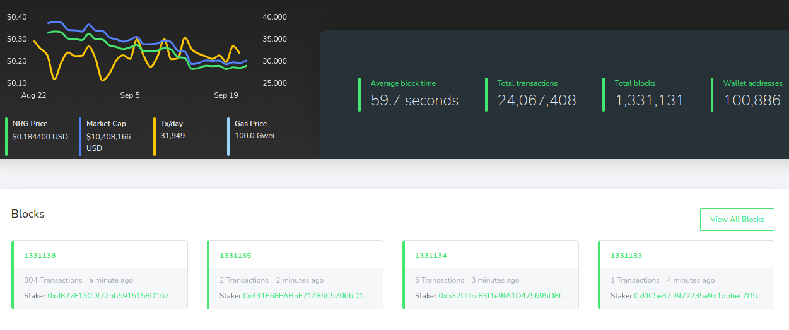

# Mini blockchain explorer

Block explorer and the most powerful API for the most popular blockchains that allows you to find, sort, and filter blockchain blocks, transactions, ... In this blueprint we try to demonstrate the some basic functionality of blockexplorer.



## Specs

* Golang > 1.18
* Two microservices
* Using docker-swarm as orchestrator
* gRPC internal connection


# Architecture


## Services

The two microservices should be:
1. Indexer (blockchain scanner)
2. Public facing REST API

## A) Indexer

This backend service should scan for transactions and capture block information: 
- number of transactions
- transaction details (hash, from, to, amount)
Captured data can
 be inserted into the database.

The indexer can be able to scan the range if given from-to parameters, or simply subscribe
to the latest blocks.

Examples:
- `Indexer 100 200` should scan all blocks from 100 to 200 (inclusive)
- `Indexer 100` should scan all blocks starting from 100 to the latest, once reached the top it should subscribe to new incoming blocks
- `Indexer` should scan for all blocks if they don't already exist in the database

## B) Restful api delivery


# Usage

```bash
docker-compose -p mini-indexer up -d
```

## Public API

REST API with the following endpoints:
- /block `[GET]`
- /stats `[GET]`
- /tx `[GET]`
- /index `[POST]`
 
Examples:
- `/block` - returns the latest block and all associated transactions
- `/block/100` - returns the block number 100 and all associated transactions
- `/stats` - returns sum of all amounts and transactions
- `/stats/100:200` - return sum of all amounts and transactions between blocks 100 and 200
- `/tx` - return latest transaction
- `/tx/0x...` - return the transactions with the specified hash
- `index/?auth_token&scan=100:200` - instructs our service to trigger indexer for a fresh scan of blocks between 100 and 200 


## To Do

[X] Fix problem in `energy_indexing-srv` once disconnected from `index-engine`