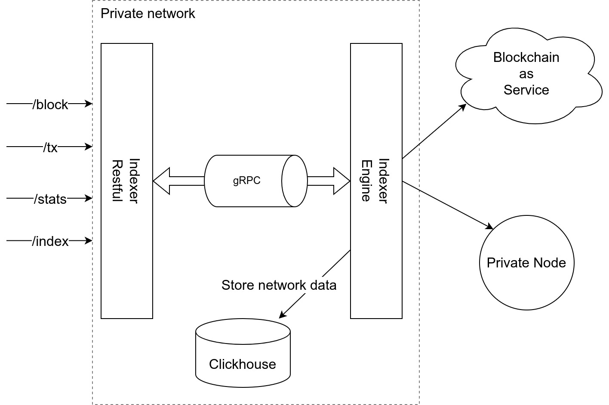

# Backend Challenge

Your task is to create a backend for **mini blockchain explorer**. An example of a fully functional explorer can be found on https://explorer.energi.network/ for orientation.

## Requirements
1. Use Golang
2. Create 2 (two) microservices
3. Raise an MR (merge request) so we can communicate
4. Any omitted details are omitted on purpose, use your best judgment to fill in the gaps 


## Structure

The two microservices should be:
1. Indexer (blockchain scanner)
2. Public facing REST API

### Indexer
This backend service should scan for transactions and capture block information: 
- number of transactions
- transaction details (hash, from, to, amount)
Captured data should be inserted into the database.

```sql
CREATE TABLE blocks(
    number INT PRIMARY KEY,
    hash CHAR(32) NOT NULL,
    tx_count INT NOT NULL
);

CREATE TABLE transactions(
    block_number INT PRIMARY KEY,
    hash CHAR(32) NOT NULL,
    from CHAR(32) NOT NULL,
    to CHAR(32) NOT NULL,
    amount NUMERIC NOT NULL,
    nonce INT NOT NULL
);
```

The indexer should be able to scan the range if given from-to parameters, or simply subscribe
to the latest blocks.

Examples:
- `Indexer 100 200` should scan all blocks from 100 to 200 (inclusive)
- `Indexer 100` should scan all blocks starting from 100 to the latest, once reached the top it should subscribe to new incoming blocks
- `Indexer` should scan for all blocks if they don't already exist in the database

### Public API

REST API with the following endpoints:
- /block `[GET]`
- /stats `[GET]`
- /tx `[GET]`
- /index `[POST]`
 
Examples:
- `/block` - returns the latest block and all associated transactions
- `/block/100` - returns the block number 100 and all associated transactions
- `/stats` - returns sum of all amounts and transactions
- `/stats/100:200` - return sum of all amounts and transactions between blocks 100 and 200
- `/tx` - return latest transaction
- `/tx/0x...` - return the transactions with the specified hash
- `index/?auth_token&scan=100:200` - instructs our service to trigger indexer for a fresh scan of blocks between 100 and 200 

# Architecture




# Usage

```bash
docker-compose -p mini-indexer up -d
```

## Todo

[] Fix problem in `energy_indexing-srv` once disconnected from `index-engine`